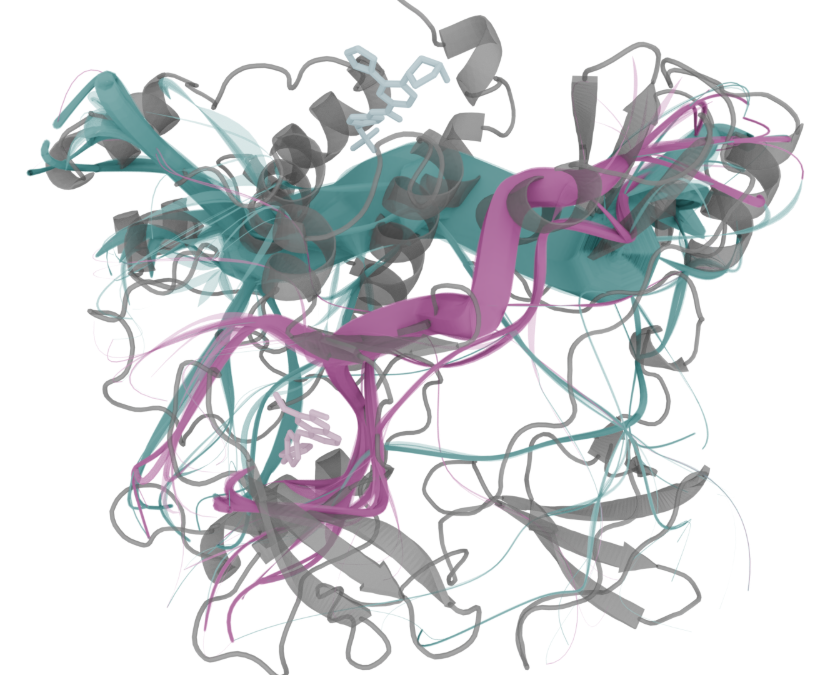

mdpath
==============================
[//]: # (Badges)

MDPath - A tool for calculating allosteric communication pathways in proteins by analyzing the mutual information of residue dihedral angle movements throughout an MD simulation.  

https://mdpath.readthedocs.io

## Instalation

MDPath can be easily installed using pip

    pip install mdpath

All dependencies are automatically installed along with the package.

## Usage

MDPath can be accesed from the comandline.
Acces this command to get an overview of all availible flags:
    
    mdpath -h

For a detailed description of the available options and outputs, see:
https://mdpath.readthedocs.io

### Citing this work
When using this tool for your research please reference this article:

Doering, N. P., Taterra, M., Bermúdez, M., & Wolber, G. (2025). MDPath: Unraveling allosteric communication paths of drug targets through molecular dynamics simulations. Journal of Chemical Information and Modeling. [https://doi.org/10.1021/acs.jcim.5c01590](https://doi.org/10.1021/acs.jcim.5c01590) 

### Copyright

Copyright (c) 2024, Niklas Piet Doering and Marvin Taterra

#### Acknowledgements
 
Project based on the 
[Computational Molecular Science Python Cookiecutter](https://github.com/molssi/cookiecutter-cms) version 1.1.
